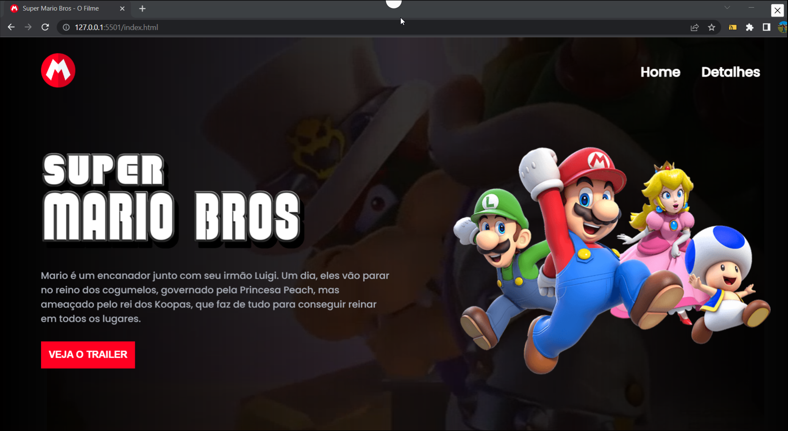

<h1 align="center"> Landing Page -Mario Boss </h1>

Projeto gratuito, promovido por Dev em Dobro para ensino de tecnologias WEB.  

  <a href="#-tecnologias">Tecnologias</a>&nbsp;&nbsp;&nbsp;|&nbsp;&nbsp;&nbsp;
  <a href="#-projeto">Projeto</a>&nbsp;&nbsp;&nbsp;|&nbsp;&nbsp;&nbsp;

 

  

## 🚀 Tecnologias

Esse projeto foi desenvolvido com as seguintes tecnologias:

- HTML e CSS
- JavaScript
- Github

## 💻 Projeto

O projeto  é uma Landing Page com o tema do filme Mario Boss que vai lançar no começo desse ano.

---

Feito com ♥ by Dev em dobro :wave: [Participe da nossa comunidade!](https://devemdobro.com/comunidade-dev-em-dobro/)